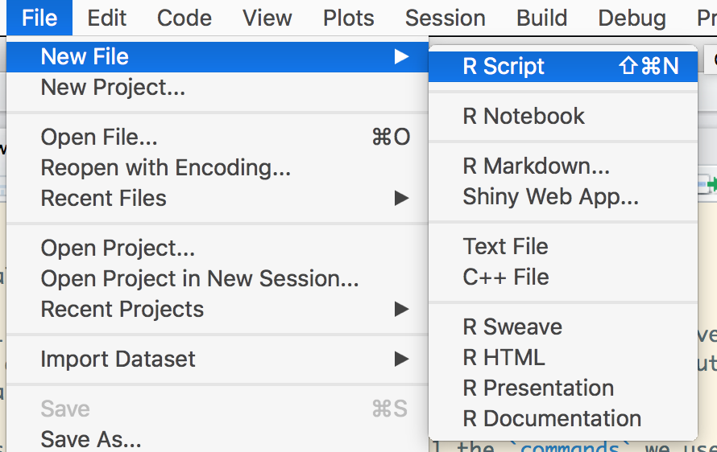
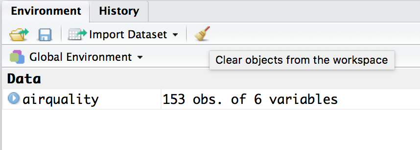
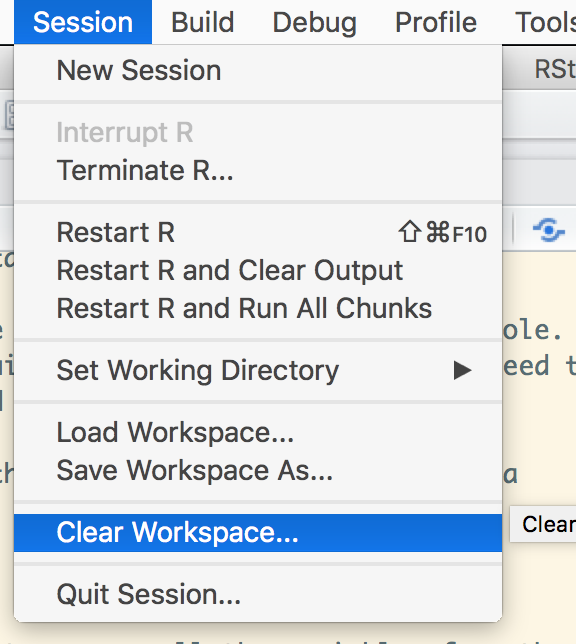
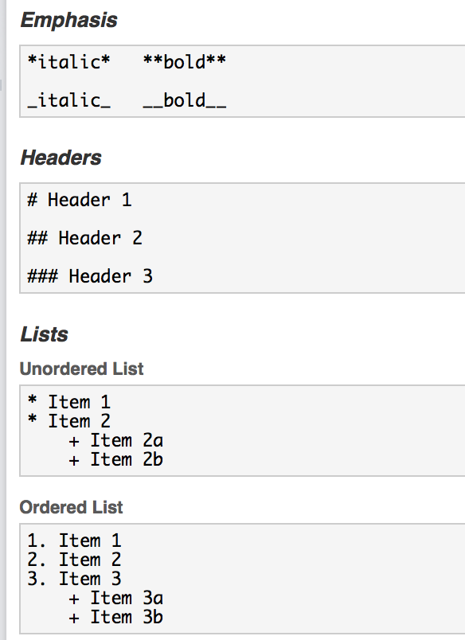

# This time it's for real!

```{r, echo=FALSE, message=FALSE}
library(pacman)
p_load(openxlsx)
```

Let's pick up the pace and put our newfound skills to the test. For this section, we're gonna use a dataset that looks more like what we'll encounter in real life. It's bigger in both dimensions; it has more rows but also more columns. It also has some missing data (oh noes!). Now things are getting real.

## Loading and exploring a larger dataset

We can load our new dataset the same way as before, using the `read.csv()` function.

```{r}
airquality <- read.csv('airquality.csv')
```

Let's take a moment to explore the new dataset using tools we learned in the previous section. Try `str`, `head`, `summary` and get a good feel for the dataset. For example, we can find the number of rows using `nrow`.

```{r}
library(magrittr) # load using `library` if not already loaded
airquality %>% nrow()
```

## Counting missing values

I mentioned this dataset has some missing data.  You may have noticed it already when exploring. In R, missing values are represented by the `NA` symbol.

It's always a good idea to check for missing values, even if you are *sure* your data is complete. We can ask R to tell us whether there are any `NA`s in the dataset using the `is.na()` function.

```{r results="hide"}
airquality %>% is.na()
```

This will list out `TRUE` or `FALSE` for *every* value in `airquality` for the question "is this value equal to `NA`?". It's kind of hard to read, though.

If we wanted to get a general sense of how many `NA`s there were in our entire dataset, we could do something like this:

```{r}
airquality %>% is.na() %>% sum()
```

If we wanted to know the location of the missing `NA`s, we could do this:

```{r}
airquality %>% is.na() %>% which()
```

## Ignoring missing values

If we try to call some descriptive statistics on any columns with `NA` values, we will get an ugly result. Let's try getting the mean for 
Ozone levels.

```{r}
library(dplyr) # load using `library` if not already loaded
airquality %>% summarise(mean(Ozone))
```

Not what we were looking for.

By default, many functions in R will return `NA` if called on a vector with any `NA` values inside. We can override this behavior by adding the `na.rm = TRUE` argument

```{r}
airquality %>% summarise(mean(Ozone, na.rm=TRUE))
```

There are important questions to ask yourself when dealing with missing data; there's no one-size-fits-all answer for it. A slapdash approach is to simply _remove_ any rows with missing data.

```{r}
aircomplete <- airquality %>% filter(complete.cases(airquality))
```
 If you call `nrow` on aircomplete, you'll see we have 111 rows now instead of the 153 we had before.

```{r}
aircomplete %>% nrow()
```

You get the same result using `na.omit()`.
```{r}
airomit <- airquality %>% na.omit()
airomit %>% nrow()
```
##Dealing with Non-numeric Data
So `NA`'s are just one example of what makes up messy data. Additionally, sometimes when reading in a file with a dataset, R will assign a variable the wrong data type.

For example, say the variable `Ozone` from our `airquality` dataframe was read in as a character vector. A character vector is a way R refers to text content. What would happen if I tried to take the mean of the `Ozone` this time?

```{r,echo=FALSE, message=FALSE }
airquality <- airquality %>% mutate(Ozone = as.character(Ozone))
```

```{r}
airquality %>% summarise(mean(Ozone, na.rm = TRUE))
```

Again, the output is not so pretty and the mean was interpreted as NA again. This is because R cannot perform calcuations like 'mean' on other types of vectors, only on numeric ones. Do not despair! R gives us the flexibility to coerce data types into other data types. So in order to get to mean of Ozone, we need to do something like this:

```{r}
airquality <- airquality %>% mutate(Ozone = as.numeric(Ozone, na.rm = TRUE))
airquality %>% summarise(mean(Ozone, na.rm = TRUE))
```

Great! We were able to mutate the data type of the variable and take the mean. Sometimes working with data types in R can be confusing but by getting into the habit of calling `str()` on a dataframe or `class()` on a variable, we can wrangle with messy data.


## Analyzing and Visualizing the data using a script

### Creating a R script to save code and analysis

Now, I want you to go back and do _everything_ we just did over again.

What, you think that's ridiculous? The reality is, we often have to go back and make changes upstream. When we do this, it can get very, very painful if we're doing everything interactively, in the _console_.

In all our previous examples we have been using the interactive console. It is an excellent application to quickly analyze the data, but we need to keep a reasonable log of what we did (and possibly why).

Let us start by creating a file, with all the `commands` we used in a sequence.

Click the symbol for New Script and you'll see RStudio's built-in text editor pop up.



And then we will clear the session, to remove all the variables from the environment. This insures that we are starting with a clean slate.






Let's take a moment to put all our work in. I know it's a pain but it will pay off if we want to make changes later.

It is good practice, in programming to place all the libraries we need at the top. Imagine arranging all the ingredients before we start following a recipie for our dish.

```{r message=FALSE}
# load libraries
library(ggplot2)
library(dplyr)
library(broom)

# read in data
airquality <- read.csv('airquality.csv')
```

We can start by visualizing the data. We have more data to play with now, but let's start with the same plot we used last time.

```{r}
# plot to compare temperature vs ozone
p <- ggplot(airquality) + geom_point(aes(x=Temp, y=Ozone))
print(p)
```

You'll notice two new things about what we did here. First, we assign the output to `p`, this will be important when we want to make adjustments to the plot later. Second, you'll notice when we do that, nothing appears; we have to print the `p` to get it to show up.

Notice how we get warning messages, with NA's, let use `complete.cases` function, to filter out such rows.


```{r}
# filter for only complete cases
aircomplete <- airquality %>% filter(complete.cases(airquality))

# create a plot comparing, Ozone levels with Temperature
p <- ggplot(aircomplete) + geom_point(aes(x=Temp, y=Ozone))
p
```


We can run the entire script by clicking *Source* at the top of the editor pane.

To run just a specific line or lines, you can select the section you want to run and then click *Run*.

Let's get back to our data. You may have seen a pattern in the plot we made earlier. Let's pick up our analysis with a little more visualization and some modeling.


## Modeling the data


We'll model the data using the reliable `lm()` function again. Let's add the following to the end of our script and *source* it.

```{r}
ozone_model <- lm(Ozone ~ Temp, data = aircomplete)
ozone_model %>% summary()
```

Our model tells us there is a *statistically significant* relationship between Ozone and Temperature. We can also check to see if any other parameters influence Ozone.

```{r}
two_model <- lm(Ozone ~ Temp + Solar.R, data = aircomplete)
two_model %>% summary()
```

We see that `Temp` is still *statistically significant* but `Solar.R` is not as much, so we can leave it out of our model.

If we want to add the single linear model to our plot, we can use the `geom_abline()` function. `geom_abline()` takes two arguments, the intercept and slope. We can use the pipeline to extract those values from the model. Add the following lines to your script and *Source* it.

```{r}
ozone_intercept <- ozone_model %>% tidy %>% filter(term == "(Intercept)") %>% select(estimate) %>% unlist()
ozone_slope <- ozone_model %>% tidy %>% filter(term == "Temp") %>% select(estimate) %>% unlist()
```

With that info, we're ready to add our linear model. Add the following lines to your script and *Source* it.

```{r}
p2 <- p + geom_abline(intercept = ozone_intercept , slope = ozone_slope)
p2
```

There's also another way to get the line drawn on your plot using `geom_smooth`. It will run the model for you, and then it will draw the line and the confidence intervals.

```{r}
p3 <- p + geom_smooth(aes(Temp, Ozone), method="lm")
p3
```

**bonus**

We could go a little further and bin the temperature variable into `high` and `low` values to enable comparison with ozone levels.

```{r}
aircomplete <- aircomplete %>% mutate(Temp2 = ifelse(Temp > 80, "high", "low"))
```

We are using `mutate` from the `dplyr` package to add a new column `Temp2`, which is a character data type based on the variable `Temp`.

Next, let us create a box plot using this new `Temp2` variable. We can use `geom_boxplot` to create this plot.

```{r}
ggplot(aircomplete) + geom_boxplot(aes(x=Temp2, y=Ozone))
```

We see that `low` shows up after `high` on the x axis, and it is counter-intuitive. This is because `Temp2` is a character,
which is sorted alphabetically (**h** before **l**). So we can use factors, as explained in the previous section, to switch their position.

```{r}
aircomplete <- aircomplete %>% mutate(Temp_factor = factor(Temp2, levels = c("low", "high")))
aircomplete %>% str()
```

Again, we use `mutate` to add another new column `Temp_factor`, which is a factor version of `Temp2`. Also, you will notice we have explicitly specified the levels in an order we would like (`low` and then `high`). This is confirmed in the `str` command.

Alright! Now let's see how `Temp_factor` looks in our boxplot.

```{r}
ggplot(aircomplete) + geom_boxplot(aes(x=Temp_factor, y=Ozone))
```


## Making a reproducible report

Great. Now, what if we want to make a report of our work? With R, you get the power of `knitr`, which will _knit_ your work together into a report. Let's try it on our current script. Go to File -> Knit Document, name the file `airquality_report` and select HTML, then watch the magic happen!


Here is a link to an example script:

* [example_script.R](https://github.com/HoustonUseRs/intro-to-R-guide/blob/master/example_script.R)
* [example_script.html](example_script.html)

R basically converts the R script into markdown, and then into HTML. So have have the option of including some additional markdown instructions in this set. We need just to prefix all lines with a `#'` to use markdown

Here are a set of a few markdown examples.


