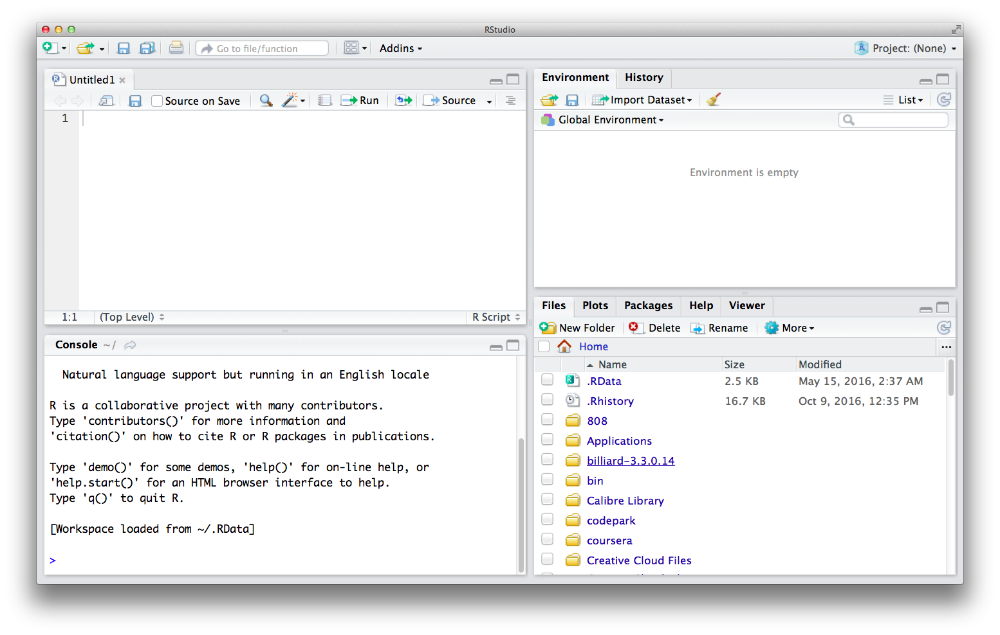

# Learning More

There are many ways to continue learning R.  No matter what you choose to be your next step, we're here and eager to share experiences and questions!  Join us in person for our [Houston R UseRs Meetups](http://www.meetup.com/houstonr/) or online in our [Slack](https://hrug.slack.com) chat anytime.

## Next Steps

[//]: <> ( If you have a specific project where R is useful, or existing datasets you're wanting to explore, we recommend using R with them, and )

The following resources are great next steps to take for learning more on using R after this workshop.

### R Basics 

To further explore basics of R, following are good resources to begin with  - 

* 
 A good blog offering tutorials of each R function/package. Platform for R users to connect 
* (http://swirlstats.com/) Learn R and data science interactively
* (https://www.coursera.org/learn/r-programming) An Intermediate R course in 4 weeks
* (https://www.rstudio.com/online-learning/) Curated guide to learning R and its extensions

### R for Data Science

These resources are good to use R as a data science/statistics tool - 

* [R Cookbook](http://www.cookbook-r.com/) Excellent resource for learning base R. Contains code snippets. Available online. [R graphic cookbook](http://www.cookbook-r.com/Graphs/) covers ggplot snippets. A must have
* [R for Data Science](http://r4ds.had.co.nz/)
This book penned by Hadley Wickham and Garrett Grolemund covers modern standards on using R for data science with a cohesive and conversational narrative.
For a great overview of what's in the book, check out [this page](http://r4ds.had.co.nz/explore-intro.html)
* [Advanced R](http://adv-r.had.co.nz/) Master R as a programming language. Also available online.
* [ggplot2](https://www.amazon.com/dp/0387981403/ref=cm_sw_su_dp?tag=ggplot2-20) Learn how to create elegant graphics for data analysis 

### Practice and Learn Data Science
Once you have learnt R, try your coding skills on analyzing a collection of public datasets. 

* Kaggle Titantic examples - Learn how to tackle a machine learning problem and participate in competetions
  * [Gettings started in R](https://www.kaggle.com/c/titanic/details/new-getting-started-with-r)
  * [Exploring Survival on the Titanic](https://www.kaggle.com/mrisdal/titanic/exploring-survival-on-the-titanic)
 * [Houston data jams](https://houstondatavis.github.io/data-jams/) Attend data visualization meetups in Houston.

* Others resources to check [R by example](http://www.mayin.org/ajayshah/KB/R/index.html), [R Examples](http://www.rexamples.com/), [Quick-R](http://www.statmethods.net/), [Data Camp](https://www.datacamp.com/), [drivendata](https://www.drivendata.org/)

### Getting Help

* Houston R UseRs [Slack](https://hrug.slack.com) and [Meetup](http://www.meetup.com/houstonr/)

* [Stack Overflow](http://stackoverflow.com/)

### Staying up to date

* [RWeekly](https://rweekly.org/)

* [Awesome-R](https://awesome-r.com/)
